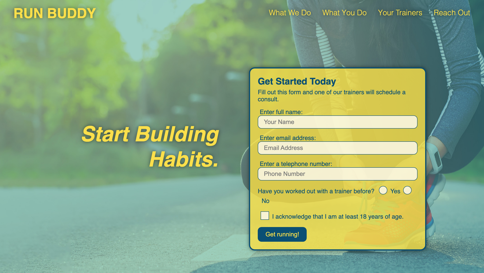

# Run Buddy, Inc.

## Description
Web application for Run Buddy, a fitness training service.

## License  
This application is covered under the following license. Please review the link below for additional information pertaining to the license.
    
  
https://www.gnu.org/licenses/gpl-3.0

## Table of Contents
[Deployed Application](#deployed-application)  
[Built With](#built-with)  
[Landing Page](#landing-page)  
[Contribution](#contribution) 

## Deployed Application
https://dylanhay.github.io/runbuddy/
## Built With
* HTML
* CSS
* Git
* GitHub Pages

## Landing Page

## Contribution
Built by Dylan Hay

### ©️2019 Run Buddy, Inc.
